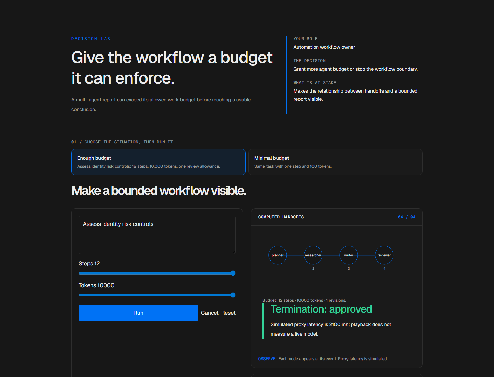
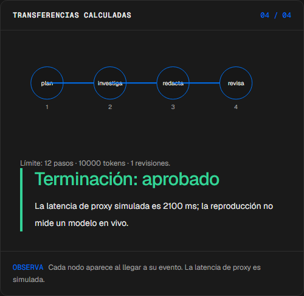
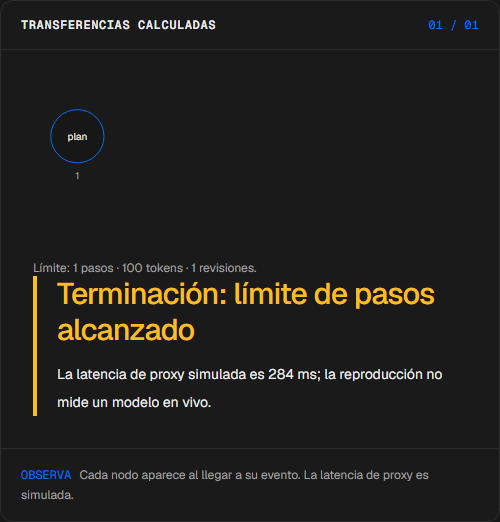
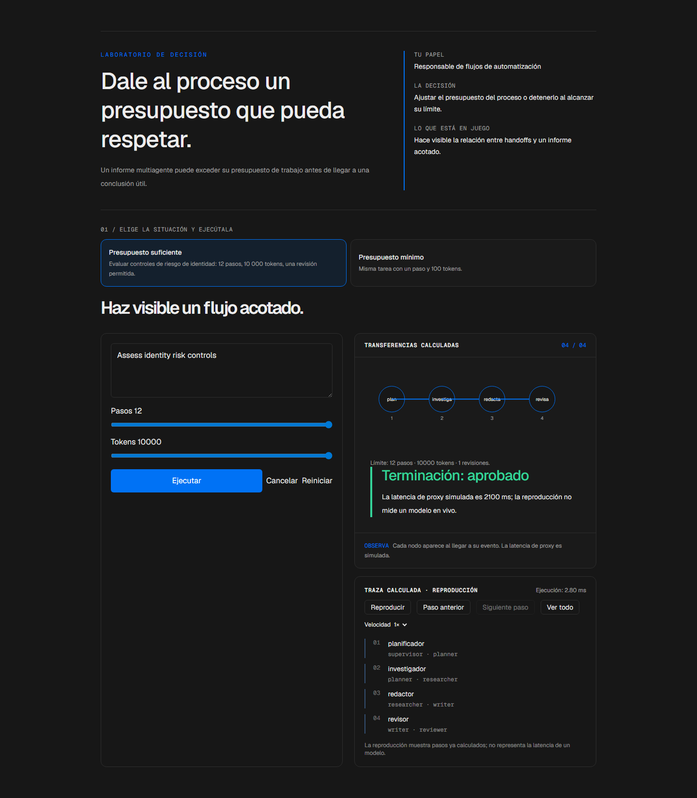

# Mesa

<!-- community-badges -->
[](https://github.com/mdeasis27/mesa/actions/workflows/ci.yml) [](LICENSE)
<!-- /community-badges -->

[English](README.md) · [Probar demo](https://mesa-manueldeasis27-2515s-projects.vercel.app/es/app) · [Caso de estudio](https://portafolio-mdea.vercel.app/es/projects/mesa) · [Código](https://github.com/mdeasis27/mesa)



Cambia tarea, presupuesto y límite de rechazos para inspeccionar traspasos y terminación.

## Dos situaciones para comparar

**Presupuesto suficiente:** Evaluar controles de riesgo de identidad: 12 pasos, 10 000 tokens, una revisión permitida. Los agentes completan sus handoffs configurados dentro del presupuesto.



**Presupuesto mínimo:** Misma tarea con un paso y 100 tokens. El grafo se detiene en su límite configurado.



## Caso de uso de negocio

Un informe multiagente puede exceder su presupuesto de trabajo antes de llegar a una conclusión útil.

**Quién lo usa:** Responsable de flujos de automatización.

**La decisión:** Ajustar el presupuesto del proceso o detenerlo al alcanzar su límite.

Elige presupuesto suficiente o mínimo, sigue handoffs de agentes e inspecciona dónde el grafo completa o se detiene.

### Prueba la decisión

**Presupuesto suficiente:** Evaluar controles de riesgo de identidad: 12 pasos, 10 000 tokens, una revisión permitida. Los agentes completan sus handoffs configurados dentro del presupuesto.

**Presupuesto mínimo:** Misma tarea con un paso y 100 tokens. El grafo se detiene en su límite configurado.

Elige un escenario, modifica sus controles y ejecuta el cálculo local. Avanza por la visualización paso a paso o revela todo. Reinicia antes de comparar el segundo escenario.

## Cómo probarlo

Abre `/en/app` (inglés, por defecto) o `/es/app` (español). Cambia los datos del escenario y ejecuta el cálculo. Inspecciona la decisión, evidencia y traza calculada. La reproducción revela pasos locales ya completados; no mide un modelo en vivo. Reiniciar empieza un escenario local nuevo. Cambiar de idioma reinicia el escenario.

La demo principal no requiere cuenta, clave de API ni base de datos. Los enlaces públicos apuntan al despliegue existente; el rediseño local está pendiente de publicación.

<!-- recruiter-mission:start -->
### Tu misión interactiva

Carga el reto de un paso con 10 000 unidades de tokens simuladas y una revisión permitida. Predice opcionalmente aprobación, límite o revisión y revela las transferencias.

Compara el máximo de pasos elegido con 12 pasos manteniendo tarea, tokens y revisiones. Otro límite puede detener ambas opciones. Se muestran pasos, unidades simuladas, borrador y terminación; un borrador no significa aprobación.

**Por qué este enfoque:** El grafo local explica transferencias sin modelos en vivo. El presupuesto se comprueba antes de cada paso: un paso puede superar el límite de tokens antes de la siguiente comprobación. Unidades y latencias son supuestos simulados, no facturación real.

**Antes de producción:** Reservar recursos antes de llamadas reales, medir uso real, controlar herramientas, persistir trazas y evaluar calidad con revisores.

Editar datos, elegir un escenario o reiniciar borra la predicción y los resultados anteriores. La comparación aparece al completar la reproducción; las demos principales no requieren cuenta ni llave.

Este lote modifica la implementación. Las capturas e informes de navegador existentes documentan la etapa anterior. Capturas nuevas, interacción, móvil y rutas HTTP siguen pendientes por los bloqueos documentados. La aprobación visual previa cubre el piloto anterior de seis misiones, no este lote.
<!-- recruiter-mission:end -->

## Instalación y verificación local

Requiere Node.js 22 y pnpm 10.

```sh
pnpm install --frozen-lockfile
pnpm dev
pnpm test
node node_modules/typescript/bin/tsc --noEmit --incremental false
pnpm lint
pnpm build
```

Abre `http://localhost:3000/en/app`. La validación registrada cubre pruebas, lint, TypeScript y builds de producción. Consulta los [resultados de comandos](docs/quality/decision-lab-verification.json) y las [comprobaciones de componentes en navegador](docs/quality/decision-lab-browser.json). Estas pruebas usan componentes React y CSS de producción con navegación de idioma controlada; no certifican rutas de Next ni el despliegue público.

## Arquitectura

- `app/[lang]/`: experiencia web por idioma.
- `lib/experience/`: adaptador local tipado, validación y trazas.
- `design-system/`: tokens visuales, controles de idioma y presentación de ejecución y reproducción.
- `app/api/`: integraciones opcionales de servidor; la demo principal no las requiere.

Tecnología: Next.js 16, TypeScript, Python, Vitest, pytest, Tailwind CSS v4.

## Evidencia y límites

Los nodos de agentes aparecen con cada transferencia de la secuencia local real; el presupuesto y la causa de terminación permanecen inspeccionables.

Proxies deterministas de agentes, consumo de presupuesto y ciclos de revisión limitados.

Hace visible la relación entre handoffs y un informe acotado.

**Límites:** Los handoffs y unidades de presupuesto son modelos locales de flujo, no contabilidad de uso real. Estos prototipos de portafolio no afirman impacto medido en producción.

Los datos son ejemplos ficticios o anónimos. Las integraciones opcionales requieren sus propias credenciales y configuración. Los secretos pertenecen al gestor configurado, nunca a archivos locales de secretos ni Git. Usa el flujo existente `infisical run -- <command>` si necesitas integraciones en vivo. La demo local no publica ni despliega automáticamente.



<!-- community-section -->
## Licencia y contribución

Publicado bajo la [licencia MIT](LICENSE). Se aceptan issues y pull requests: lee antes [CONTRIBUTING.md](CONTRIBUTING.md) y el [Código de Conducta](CODE_OF_CONDUCT.md). Para reportar una vulnerabilidad, consulta [SECURITY.md](SECURITY.md).
<!-- /community-section -->
