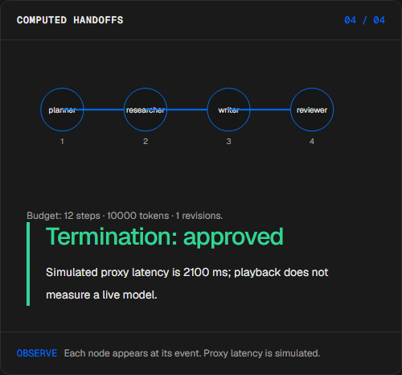
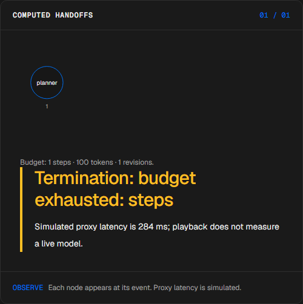
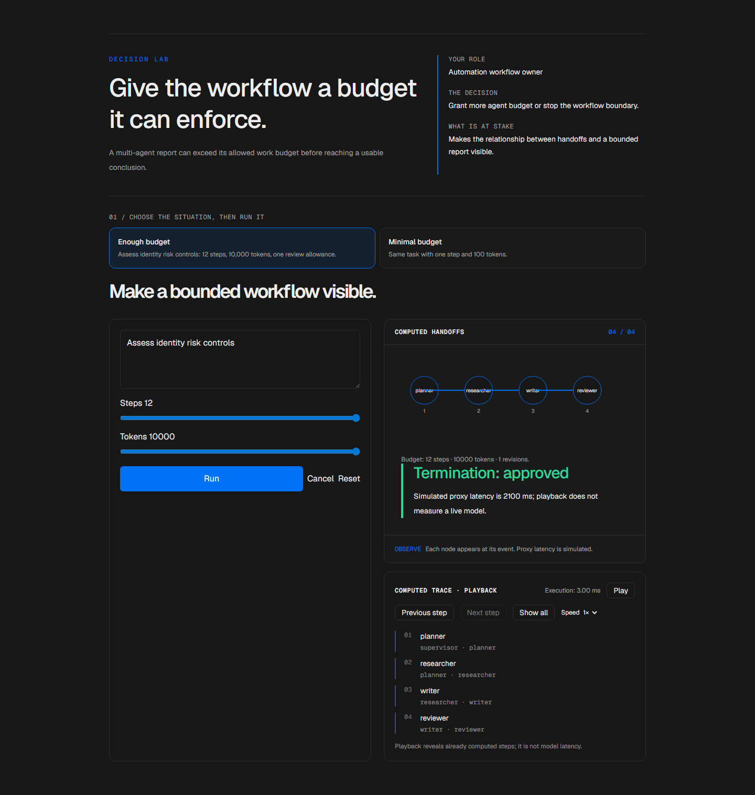

# Bounded agent workflow

[Español](README.es.md) · [Try the demo](https://mesa-manueldeasis27-2515s-projects.vercel.app/en/app) · [Case study](https://manueldeasis.com/en/projects/mesa) · [Source](https://github.com/mdeasis27/mesa)


Change a task, execution budget and rejection cap to inspect handoffs and termination.

## Two situations to compare

**Enough budget:** Assess identity risk controls: 12 steps, 10,000 tokens, one review allowance. Agents complete their configured handoffs within budget.



**Minimal budget:** Same task with one step and 100 tokens. The graph stops at its configured boundary.



## Business use case

A multi-agent report can exceed its allowed work budget before reaching a usable conclusion.

**Who uses it:** Automation workflow owner.

**The decision:** Grant more agent budget or stop the workflow boundary.

Choose enough or minimal budget, trace agent handoffs, and inspect where the graph completes or stops.

### Try the decision

**Enough budget:** Assess identity risk controls: 12 steps, 10,000 tokens, one review allowance. Agents complete their configured handoffs within budget.

**Minimal budget:** Same task with one step and 100 tokens. The graph stops at its configured boundary.

Choose a scenario, edit its controls and run the local computation. Step through the visual process or reveal all steps. Reset before comparing the second scenario.

## How to try it

Open `/en/app` (English, default) or `/es/app` (Spanish). Change the scenario inputs and run the computation. Inspect the resulting decision, evidence and computed trace. Playback reveals completed local steps; it does not measure a live model. Reset starts a new local scenario. Changing language resets the scenario.

The primary demo needs no account, API key or database. Public links refer to the existing deployment; local redesign changes are pending publication.

<!-- recruiter-mission:start -->
### Your interactive mission

Load the one-step challenge with 10,000 modeled token units and one revision allowance. Optionally predict approval, budget stop or review, then reveal the handoffs.

Compare the selected step cap with 12 steps on the same task, token cap and revision allowance. Both may stop when another limit binds. Show consumed steps, modeled token units, draft availability and termination; a draft is not approval.

**Why this approach:** A bounded local agent graph explains handoffs without live models. Budgets are checked before each step, so a step can exceed the token cap before the next check. These units and latencies are simulation assumptions, not usage billing.

**Before production:** Reserve resources before real calls, meter actual usage, constrain tools, persist traces and evaluate output quality with reviewers.

Editing inputs, choosing a preset or resetting clears the prediction and obsolete results. Comparisons appear only at completed playback; the primary demos need no account or key.

This batch changes the implementation. Existing screenshots and browser reports document the previous stage. Fresh captures, browser interaction, mobile and HTTP verification remain pending under the documented tool denials. Prior owner visual approval covers the earlier six-mission pilot, not this batch.
<!-- recruiter-mission:end -->

## Local setup and verification

Requires Node.js 22 and pnpm 10.

```sh
pnpm install --frozen-lockfile
pnpm dev
pnpm test
node node_modules/typescript/bin/tsc --noEmit --incremental false
pnpm lint
pnpm build
```

Open `http://localhost:3000/en/app`. Recorded validation covers tests, lint, TypeScript and production builds. See [command results](docs/quality/decision-lab-verification.json) and [browser component checks](docs/quality/decision-lab-browser.json). The new browser checks exercise real React components and production CSS with controlled locale navigation; they do not certify Next routes or public deployment.

## Architecture

- `app/[lang]/`: localized browser experience.
- `lib/experience/`: typed local adapter, validation and run traces.
- `design-system/`: shared visual tokens, locale controls and execution/replay presentation.
- `app/api/`: optional server integrations; the primary demo does not require them.

Technology: Next.js 16, TypeScript, Python, Vitest, pytest, Tailwind CSS v4.

## Evidence and limitations

Agent nodes appear one handoff at a time in the actual local execution sequence; the budget and termination reason stay inspectable.

Deterministic agent proxies, budget consumption and bounded review loops.

Makes the relationship between handoffs and a bounded report visible.

**Limits:** Agent handoffs and budget units are local workflow models, not live usage accounting. These portfolio prototypes do not claim measured production impact.

Inputs use fictional or anonymized examples. Optional live integrations require their own credentials and operational setup. Secrets belong in the configured secret manager, never in local secret files or Git. Use the existing `infisical run -- <command>` workflow when live integration is needed. This repository does not publish or deploy automatically as part of the local demo.


